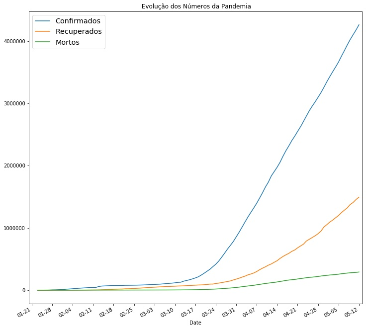
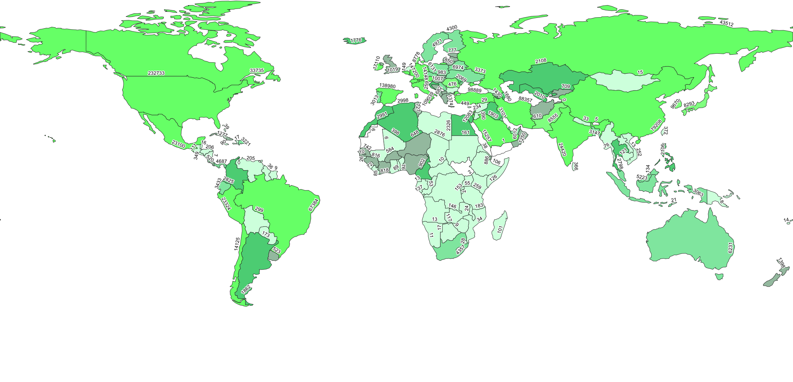

# Epidemiologia Covid-19
 
 Este trabalho foi realizado no âmbito da cadeira de SIG (Sistemas de Informação Geográfica), tendo como objetivo a análise epidemiologica do Covid-19.

Este Github está dividido em 3 partes, duas partes de análise global, uma partir de  gráficos outra a partir de mapas e uma terceira de &&&.

A primeira parte encontra-se _____ , podendo ser encontrados vários gráficos (taxa de____), sendo o mais relevante o seguinte:



Também foram construidos vários mapas do mundo, um deles sendo este:


```
Give an example
```


## Autores

* **Miguel Pinto**  - [miguelpinto-98](https://github.com/miguelpinto-98)

Ver também a lista de  [contributors](https://github.com/miguelpinto-98/Epidemiologia/contributors) que participaram no projeto.
