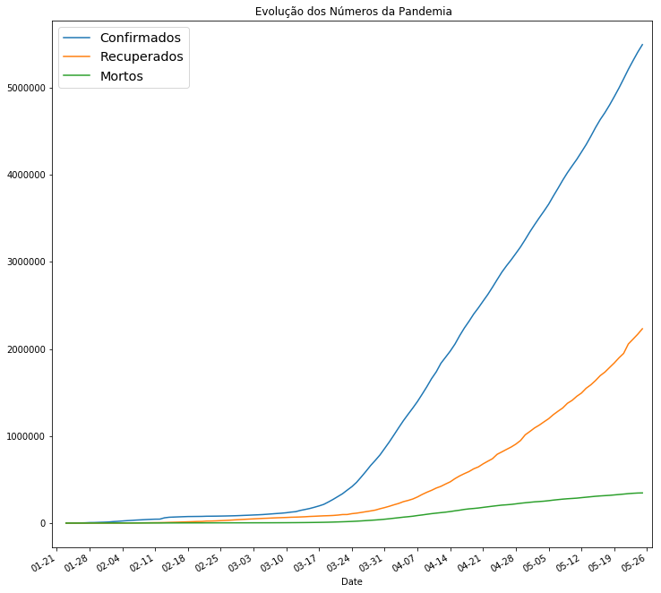
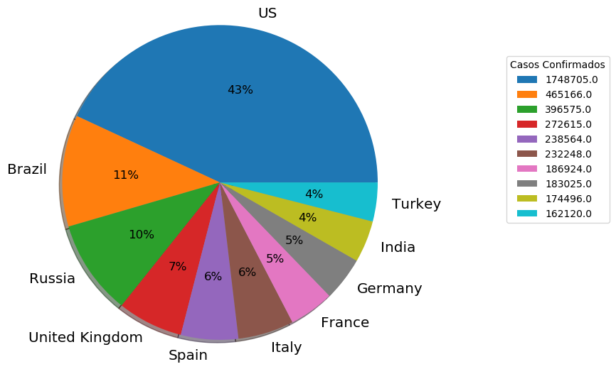
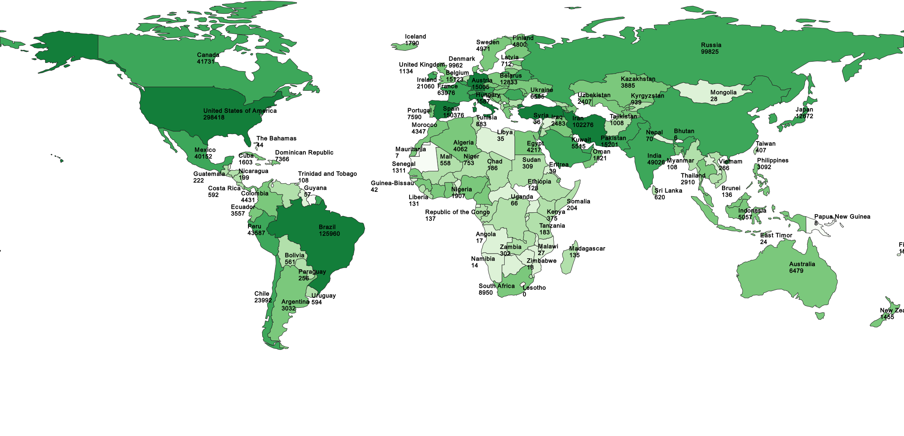
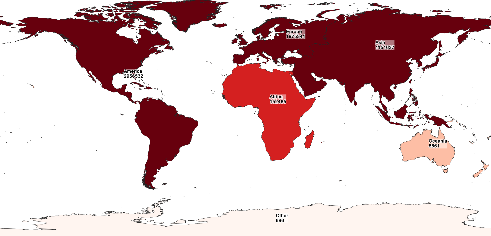
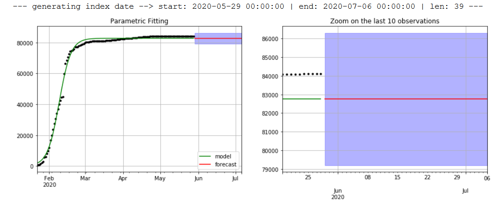
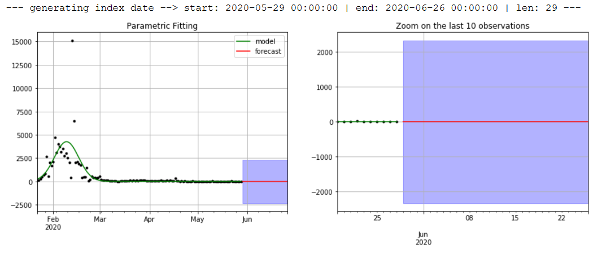

# Epidemiologia Covid-19
 
 Este trabalho foi realizado no âmbito da cadeira de SIG (Sistemas de Informação Geográfica), tendo como objetivo a análise epidemiologica do Covid-19.

Este Github está dividido em 3 partes, duas partes de análise global, uma partir de  gráficos outra a partir de mapas e uma terceira para a resolução de exercicios propostos no  [GitHub Jgrocha](https://github.com/jgrocha/covid-pt/tree/master/Jupyter).

## [Estatística_Mundial.ipynb](https://github.com/miguelpinto-98/Epidemiologia/blob/master/Estatística_Mundial.ipynb) 
* Gráficos com estatisticas mundias com a evolução da pandemia, 2 exemplos :

## [Dados_Por_País.ipynb](https://github.com/miguelpinto-98/Epidemiologia/blob/master/Dados_Por_País.ipynb) 
* Vários mapas criados a partir do PyQgis com a evolução da pandemia por País a nível mundial  sendo o mais relevante o seguinte (mapa mundo de recuperados):

## [Dados_Por_Continente.ipynb](https://github.com/miguelpinto-98/Epidemiologia/blob/master/Dados_Por_Continente.ipynb) 
* Vários mapas criados a partir do PyQgis com a evolução da pandemia por continente, sendo o mais relevante o seguinte (mapa mundo de recuperados):

## [Previsão Pandemia na China/Previsão.ipynb](https://github.com/miguelpinto-98/Epidemiologia/blob/master/Previs%C3%A3o%20Pandemia%20na%20China/Previs%C3%A3o.ipynb) 

Foi feita uma previsão para o número de casos totais da China com base numa função logística, para os 40 dias seguintes:

Também foi feita uma previsão para o número de novos casos diarios da China com base numa função gaussiana, para os 40 dias seguintes:

## Autores

* **Miguel Pinto**  - [miguelpinto-98](https://github.com/miguelpinto-98)

Ver também a lista de  [contributors](https://github.com/miguelpinto-98/Epidemiologia/contributors) que participaram no projeto.
